# Relay

Relay is a self-hosted, one-way calendar synchronization service from Schoolbox to Google Workspace. It matches Google Directory identities to Schoolbox users, reads calendar data for enabled users, applies an administrator-defined event policy, and reconciles Relay-managed events into Google Calendar.

Google access uses a service account with Domain-Wide Delegation. End users do not install an application or grant individual consent. The administration interface provides configuration, user coverage controls, run history, diagnostics, and role-based IT access.

Relay is an independent project and is not affiliated with or endorsed by Schoolbox or Google.

## Screenshots

Screenshots use an isolated database containing fictional `example.edu` sample data. Each image links to its full-resolution source.

### Overview

[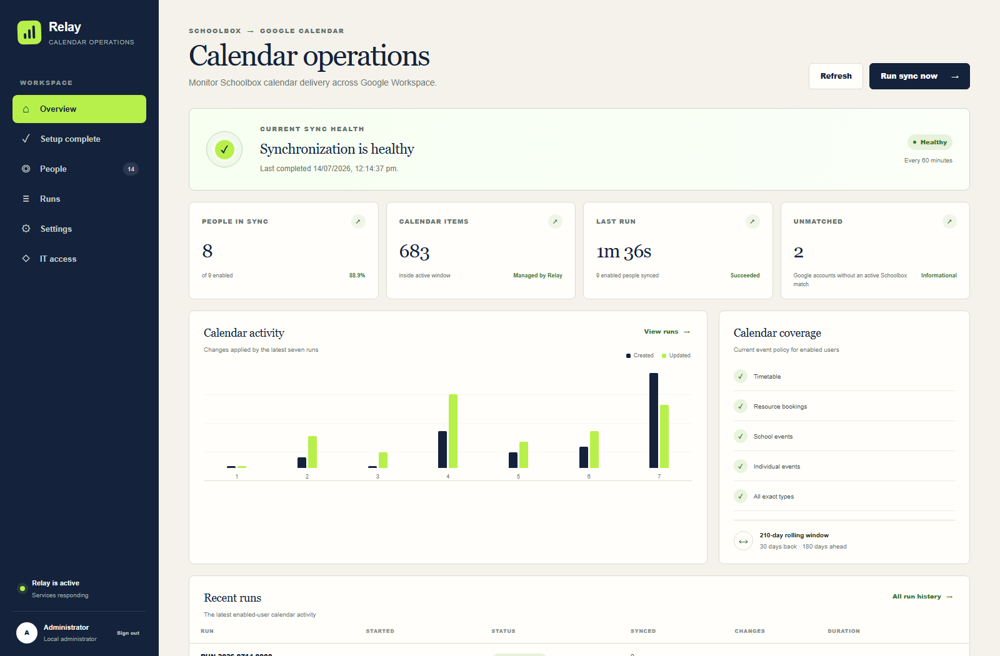](docs/screenshots/overview.png)

### Administration workflow

| Sign in | Setup complete |
| --- | --- |
| [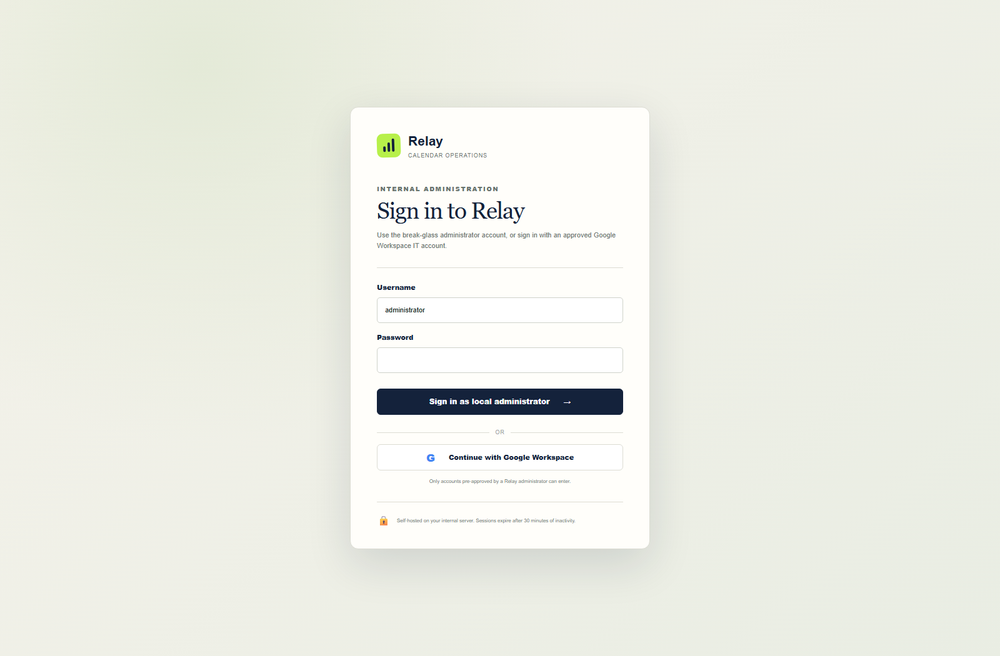](docs/screenshots/login.png) | [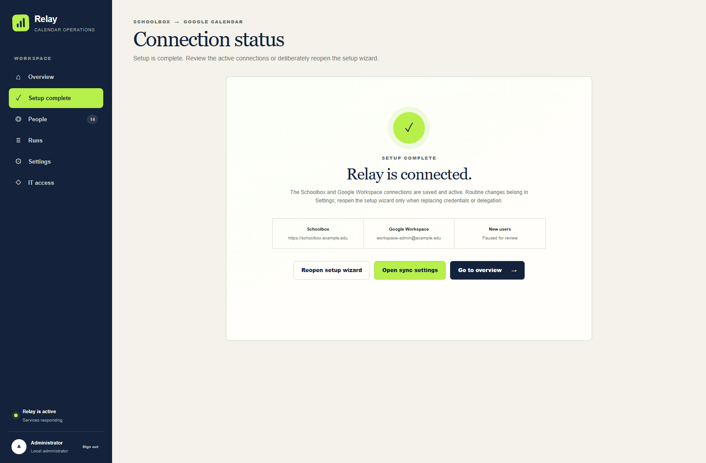](docs/screenshots/setup-complete.png) |
| **People and sync coverage** | **Runs and troubleshooting** |
| [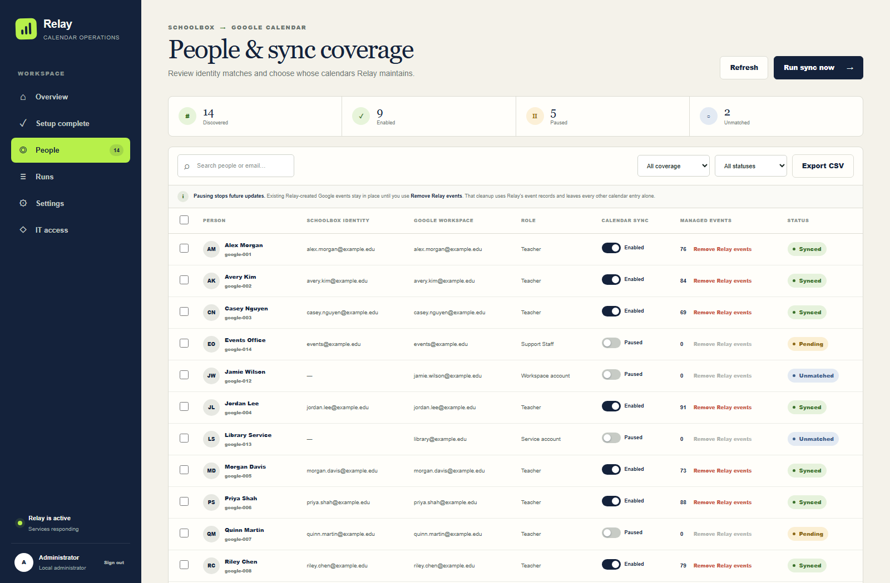](docs/screenshots/people.png) | [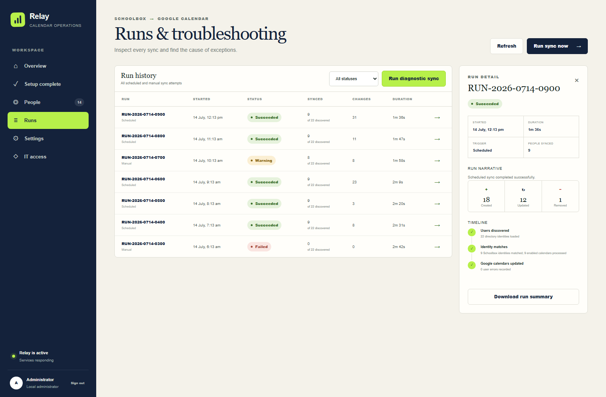](docs/screenshots/runs.png) |
| **IT access** | |
| [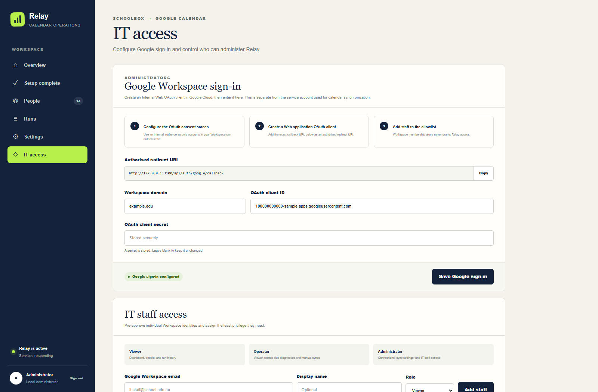](docs/screenshots/it-access.png) | |

### Sync settings

| Schedule | New-user coverage |
| --- | --- |
| [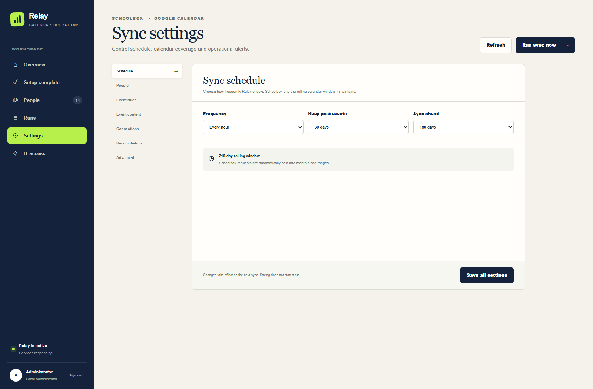](docs/screenshots/settings-schedule.png) | [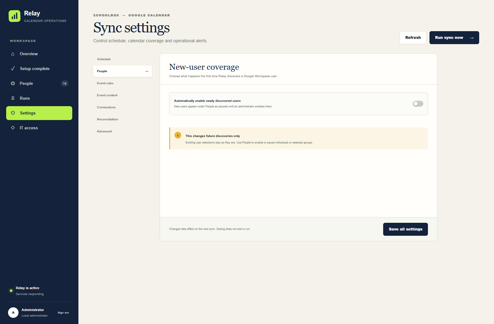](docs/screenshots/settings-people.png) |
| **Event rules and calendar routing** | **Event content** |
| [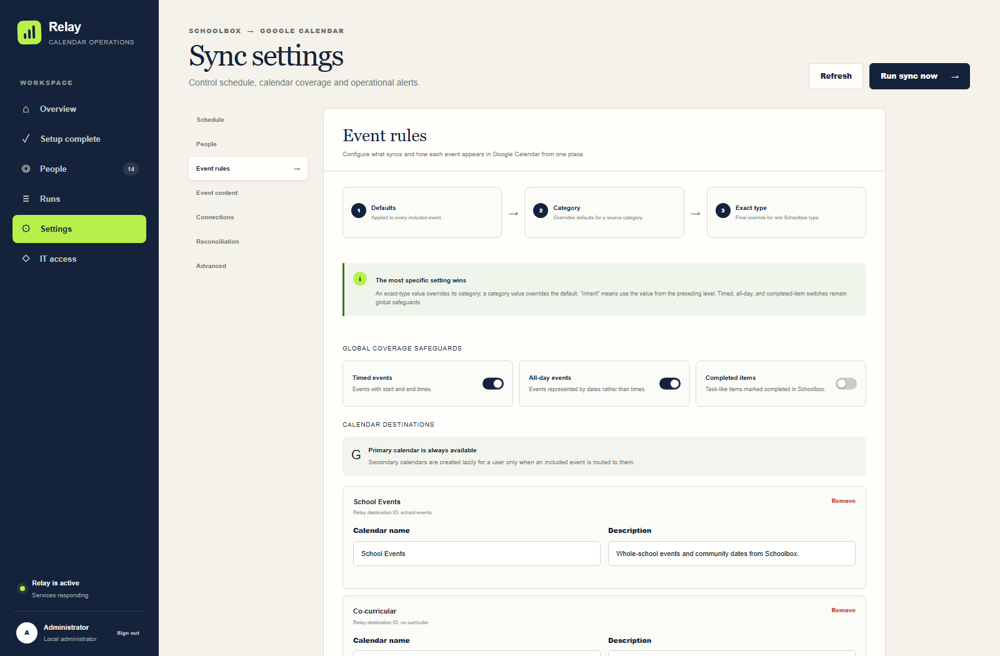](docs/screenshots/settings-event-rules.png) | [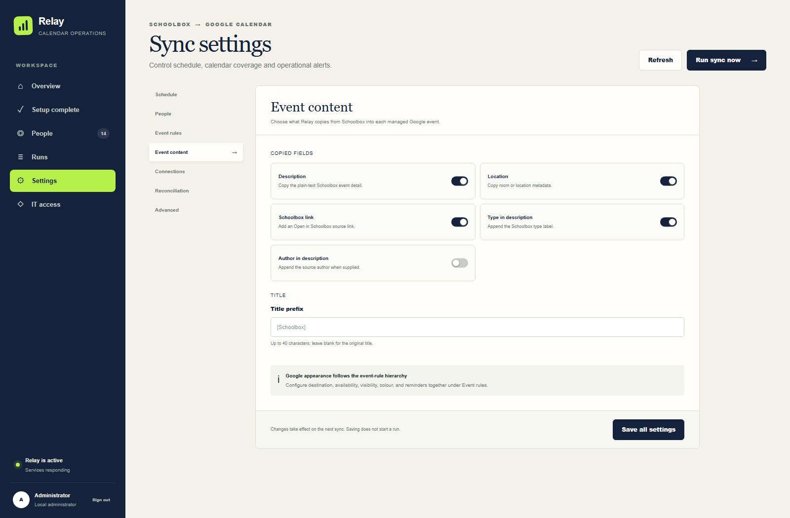](docs/screenshots/settings-event-content.png) |
| **Connections** | **Reconciliation** |
| [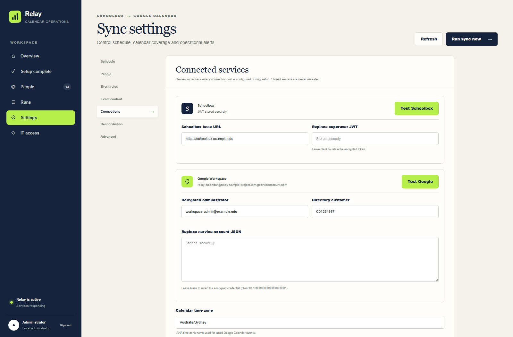](docs/screenshots/settings-connections.png) | [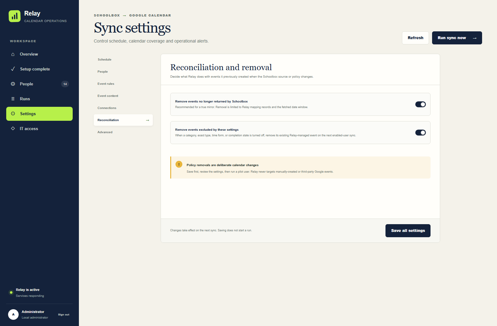](docs/screenshots/settings-reconciliation.png) |
| **Advanced operations** | |
| [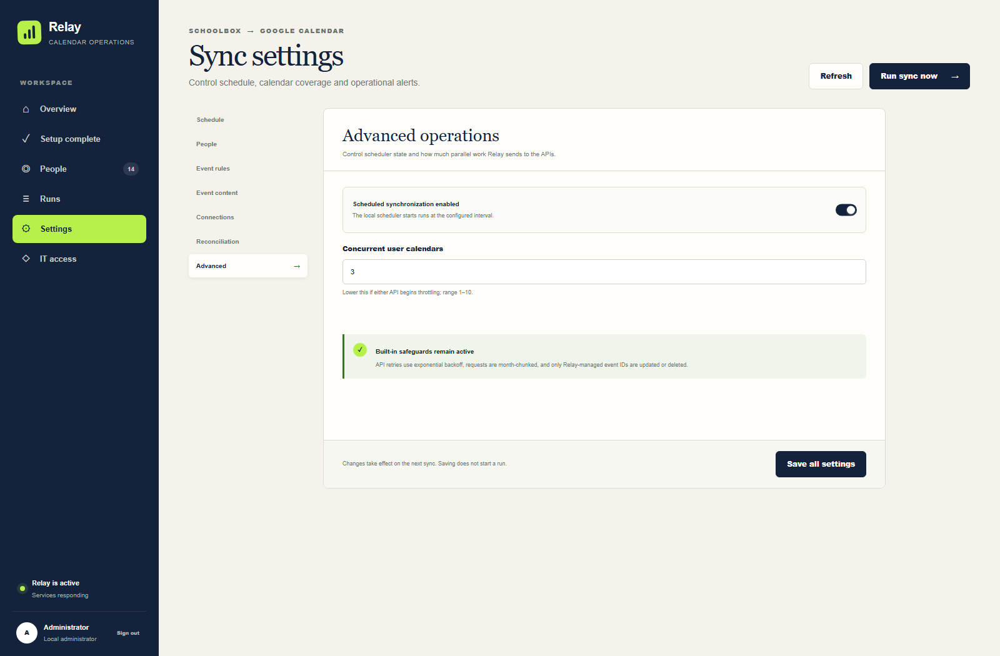](docs/screenshots/settings-advanced.png) | |

## Architecture

- Next.js administration interface and API
- Integrated authenticated scheduler
- SQLite configuration and operational database
- Schoolbox calendar and user API client
- Google Admin SDK Directory client
- Google Calendar API client with Domain-Wide Delegation
- Google OpenID Connect for approved IT staff
- AES-256-GCM encryption for stored credentials

Relay supports one application replica per SQLite database. The Node server listens on `0.0.0.0:3000`; production access requires an internal HTTPS reverse proxy and network restrictions to the IT subnet or VPN.

## Capabilities

- Google Directory discovery with Schoolbox primary and alternate email matching
- Per-user enable and pause controls with bulk selection
- Timetable, resource booking, school event, individual event, and custom event support
- Timed, all-day, and completed-item filters
- Global, category, and exact Schoolbox event-type rules
- Primary and app-created secondary Google Calendar destinations
- Per-rule availability, visibility, colour, and reminder configuration
- Configurable event content and title prefixes
- Managed-event reconciliation and targeted cleanup
- Scheduled and manual runs with diagnostics and run history
- Local break-glass administration and Google Workspace role-based access

## Requirements

- Linux server with Docker Engine and Docker Compose, or Node.js 22.13 or newer
- Internal DNS name and trusted TLS certificate
- Reverse proxy such as nginx, Caddy, IIS, or an existing internal load balancer
- Schoolbox 26.0 or newer
- Schoolbox superuser JWT with user-list and delegated calendar access
- Google Cloud project with Admin SDK and Google Calendar API enabled
- Google service account with Domain-Wide Delegation
- Google Workspace administrator permitted to list Directory users
- Google Web OAuth client with an Internal audience for IT sign-in

## Deployment

### Network

- Publish only the HTTPS reverse-proxy endpoint to the IT network or VPN.
- Restrict port `3000` to the reverse proxy or loopback.
- Set `APP_ORIGIN` to the exact externally accessed HTTPS origin.
- Use a hostname under an organisation-controlled domain. Google web OAuth redirect URIs require HTTPS except on localhost.
- Use [deploy/nginx-relay.conf.example](deploy/nginx-relay.conf.example) as the nginx baseline.

### Docker

Generate the production environment:

```bash
npm run setup:env
```

This command creates `.env.production` with independent values for credential encryption, browser sessions, and scheduler authentication.

Build the image and create the local administrator:

```bash
docker compose build
docker compose run --rm relay node scripts/bootstrap-admin.mjs
```

The administrator bootstrap requires a username (`administrator` by default) and a password of at least 14 characters. It refuses to replace an existing owner.

Start the service:

```bash
docker compose up -d
docker compose ps
curl http://127.0.0.1:3000/api/health
```

The expected health response is `{"ok":true}`. Docker stores operational state in the `relay-calendar-data` volume.

### Native Node.js

```bash
npm ci
npm run setup:env
npm run auth:bootstrap
npm run build
npm start
```

The process supervisor must use the project directory as its working directory and restart the service on failure. Multiple application replicas must not share the SQLite database.

### Local development

```bash
npm ci
npm run setup:dev-env
npm run auth:bootstrap
npm run dev
```

The development origin is `http://127.0.0.1:3000`.

## Google configuration

### Domain-Wide Delegation

Create a dedicated Google service account and grant its numeric client ID the following scopes in **Google Admin > Security > Access and data control > API controls > Manage Domain Wide Delegation**:

```text
https://www.googleapis.com/auth/calendar.events.owned,https://www.googleapis.com/auth/calendar.app.created,https://www.googleapis.com/auth/admin.directory.user.readonly
```

The service-account JSON and delegated Workspace administrator email are configured in Relay under **Setup** or **Settings > Connections**.

### IT OpenID Connect

The Google Web OAuth client used for administrator sign-in is separate from the synchronization service account.

1. Configure a Google OAuth consent screen with an **Internal** audience.
2. Create a **Web application** OAuth client.
3. Add the exact callback URL displayed under **IT access** as an authorised redirect URI.
4. Configure the Workspace domain, client ID, and client secret in Relay.
5. Add approved IT staff emails and assign a role.

Relay validates the signed ID token issuer, audience, expiry, nonce, verified email, Workspace domain, and stable Google subject. Workspace membership alone does not grant access.

## Schoolbox configuration

Relay requires an HTTPS Schoolbox base URL and a superuser JWT. The JWT is created from the Schoolbox superuser record under `TOKENS`. Connection validation is available in the setup wizard and under **Settings > Connections**.

The first manual run discovers Directory users and Schoolbox matches. Fresh installations leave newly discovered users paused by default, allowing coverage review before calendar writes.

## Synchronization model

### Identity and coverage

- Google users are keyed by stable Google ID.
- A unique Schoolbox primary email match takes precedence over an alternate email match.
- Ambiguous addresses at the same match level remain unmatched.
- Inactive Schoolbox users are excluded from matching.
- Google-only accounts are labelled **Unmatched** as an informational state.
- Only users with **Calendar sync** enabled are processed.
- Pausing a user stops future changes but retains existing Relay-managed events.
- **Remove Relay events** pauses the user and deletes only events recorded in Relay's mapping table.

### Event policy

Rule precedence is deterministic:

1. Global Google defaults
2. Source category overrides
3. Exact Schoolbox event-type overrides

Exact-type rules can override inclusion, destination, visibility, availability, colour, and reminder behaviour. Timed, all-day, and completed-item switches remain global safeguards.

| Settings section | Function |
| --- | --- |
| Schedule | Run interval and rolling date window |
| People | Default coverage for newly discovered users |
| Event rules | Category/type inclusion and Google Calendar routing |
| Event content | Description, location, source link, annotations, and title prefix |
| Connections | Schoolbox, Google service account, delegated administrator, Directory customer, and time zone |
| Reconciliation | Removal of missing or newly excluded managed events |
| Advanced | Scheduler state and per-user concurrency |

Secondary calendars are created lazily per user when an included event targets the destination. Relay stores the returned calendar ID for each user. Destination changes create the managed event in the new calendar before deleting the prior copy. Removing a destination from Relay does not delete the Google calendar.

Schoolbox API date ranges are divided into month-sized requests. Events with one missing timed boundary are normalized to a 30-minute duration; events with one missing all-day boundary are normalized to one calendar day.

## Authentication and authorization

| Role | Permissions |
| --- | --- |
| Viewer | Dashboard, user mappings, and run history |
| Operator | Viewer permissions plus diagnostics and manual runs |
| Administrator | Operator permissions plus connection, policy, OAuth, and staff management |
| Local administrator | Administrator permissions plus local break-glass password ownership |

The local administrator uses a PBKDF2-HMAC-SHA-256 password hash. Google staff access is allowlist-based. Administrators can manage other Google staff accounts; only the local administrator can change the break-glass password.

Sessions use opaque random tokens stored as hashes, HTTP-only cookies, an eight-hour absolute lifetime, a 30-minute idle timeout, CSRF tokens, and exact-origin validation. The interface warns five minutes before expiration. Five failed local password attempts lock the account for 15 minutes.

## Persistence and security

SQLite stores encrypted connection credentials, configuration, staff access, session hashes, user mappings, managed-event mappings, calendar destinations, audit entries, and run history.

`CONFIG_ENCRYPTION_KEY` protects Schoolbox, service-account, and OAuth credentials with AES-256-GCM. The database and its matching environment file form one recovery set. Sensitive files, backups, and credentials require restricted filesystem permissions and protected backup storage.

Relay makes outbound HTTPS requests only to the configured Schoolbox host and Google identity, Directory, OAuth, and Calendar endpoints.

## Operations

- Health: `GET /api/health`
- Container status: `docker compose ps`
- Logs: `docker compose logs -f --tail=200 relay`
- Stop: `docker compose down`
- Scheduler and run diagnostics: **Runs**
- Connection diagnostics: **Settings > Connections**
- Backup, restore, upgrade, and password recovery: [Operations guide](docs/operations.md)

## References

- [Schoolbox API](https://api.schoolbox.com.au/)
- [Google Workspace Domain-Wide Delegation](https://developers.google.com/identity/protocols/oauth2/service-account#delegatingauthority)
- [Google Calendar authorization scopes](https://developers.google.com/workspace/calendar/api/auth)
- [Google Calendar event resource](https://developers.google.com/workspace/calendar/api/v3/reference/events)
- [Google Directory users.list](https://developers.google.com/workspace/admin/directory/reference/rest/v1/users/list)
- [Google OpenID Connect](https://developers.google.com/identity/openid-connect/openid-connect)
- [Google OAuth web server applications](https://developers.google.com/identity/protocols/oauth2/web-server)
- [Next.js self-hosting](https://nextjs.org/docs/app/guides/self-hosting)

## License

Relay is licensed under the [MIT License](LICENSE).
