# Relay

Relay is a self-hosted, one-way calendar synchronization service from Schoolbox to Google Workspace, Microsoft 365, or both. It matches target-directory identities to Schoolbox users, reads calendar data for enabled users, applies an administrator-defined event policy, and reconciles Relay-managed events into Google Calendar and Outlook Calendar.

Google access uses a service account with Domain-Wide Delegation. Microsoft 365 access uses a single-tenant Microsoft Entra application and the OAuth 2.0 client-credentials flow. End users do not install an application or grant individual consent. Each target has independent discovery, coverage, policy, routing, cleanup, and new-user defaults. The administration interface provides configuration, run history, diagnostics, and role-based IT access.

Relay is an independent project and is not affiliated with or endorsed by Schoolbox, Google, or Microsoft.

For a new deployment, follow the [command-by-command Ubuntu installation guide](docs/installation.md). It starts with a fresh server and covers Docker, private environment secrets, loopback-only application binding, nginx TLS, firewall rules, the local administrator, provider setup, and a safe pilot.

## Screenshots

Screenshots use an isolated database containing fictional `example.edu` sample data. Each image links to its full-resolution source.

### Overview

[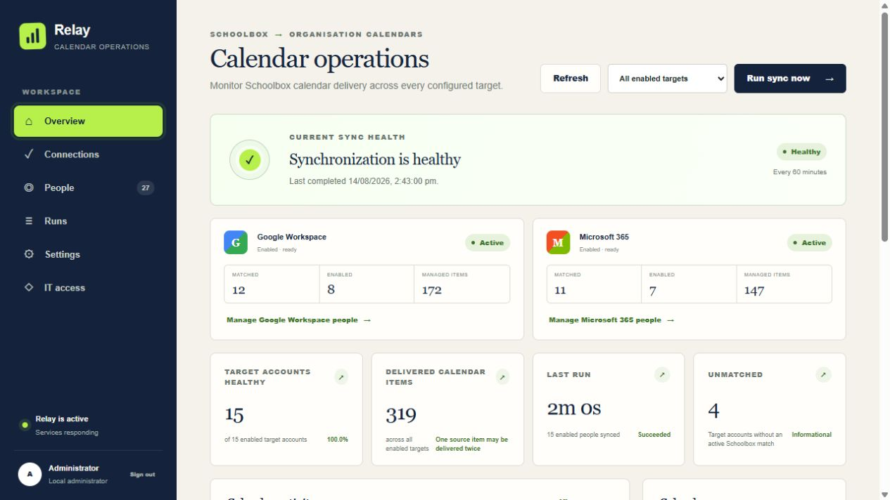](docs/screenshots/overview.png)

### Administration workflow

| Sign in | Independent connection setup |
| --- | --- |
| [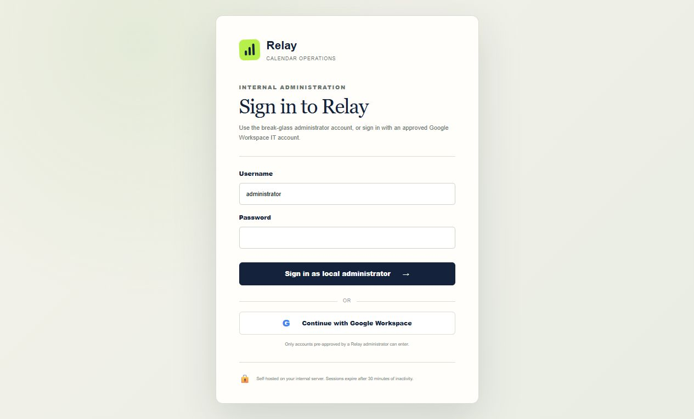](docs/screenshots/login.png) | [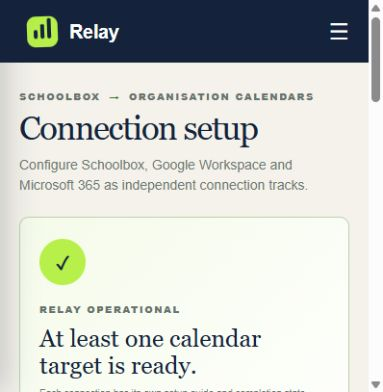](docs/screenshots/connections.png) |
| **Microsoft 365 setup guide** | **Runs and troubleshooting** |
| [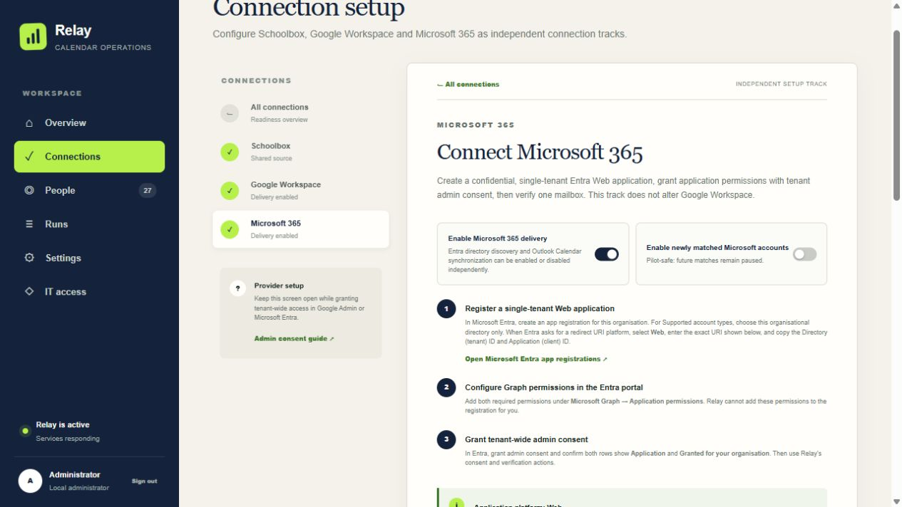](docs/screenshots/setup-microsoft.png) | [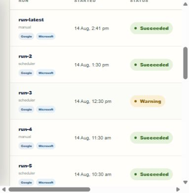](docs/screenshots/runs.png) |
| **Google Workspace people** | **Microsoft 365 people** |
| [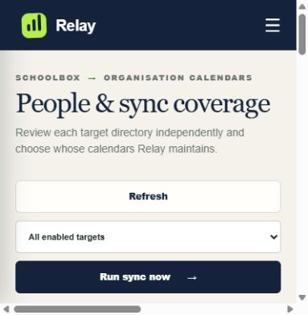](docs/screenshots/people-google.png) | [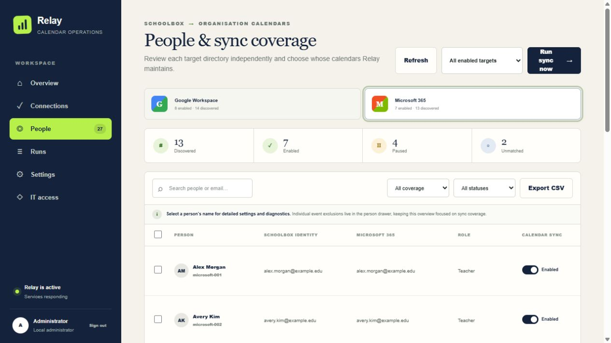](docs/screenshots/people-microsoft.png) |
| **IT access** | |
| [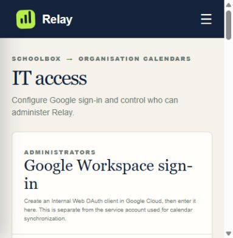](docs/screenshots/it-access.png) | |

### Sync settings

| Schedule | New-user coverage |
| --- | --- |
| [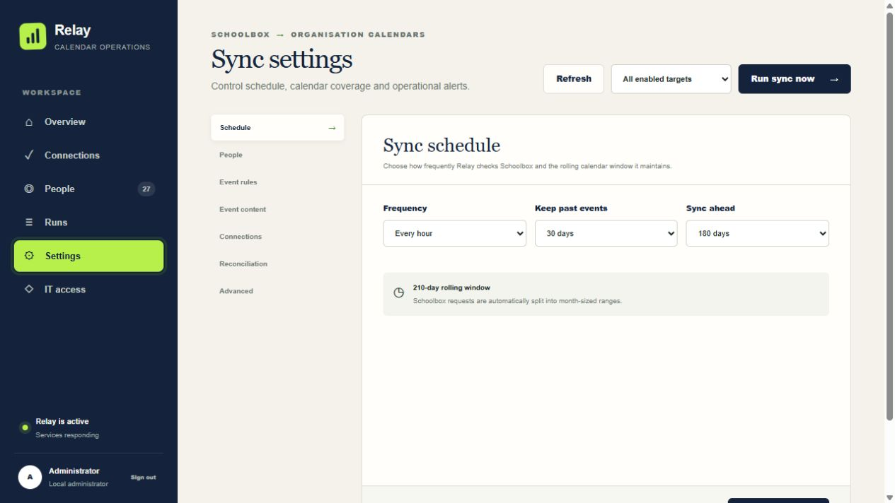](docs/screenshots/settings-schedule.png) | [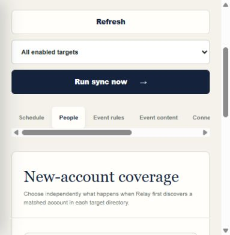](docs/screenshots/settings-people.png) |
| **Google Calendar routing** | **Outlook Calendar routing** |
| [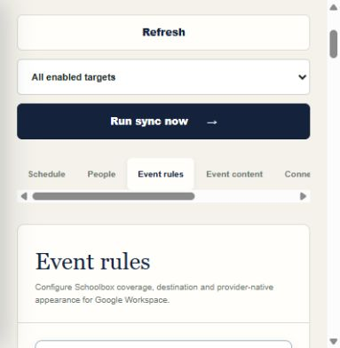](docs/screenshots/settings-event-rules-google.png) | [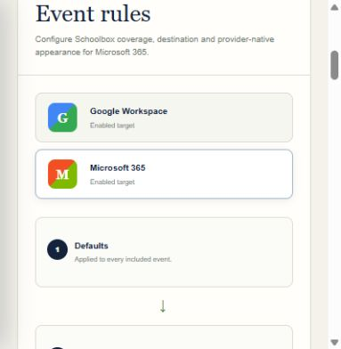](docs/screenshots/settings-event-rules-microsoft.png) |
| **Event content** | **Connections** |
| [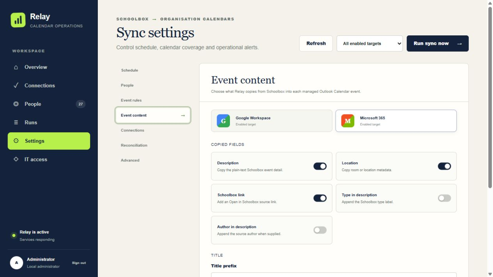](docs/screenshots/settings-event-content.png) | [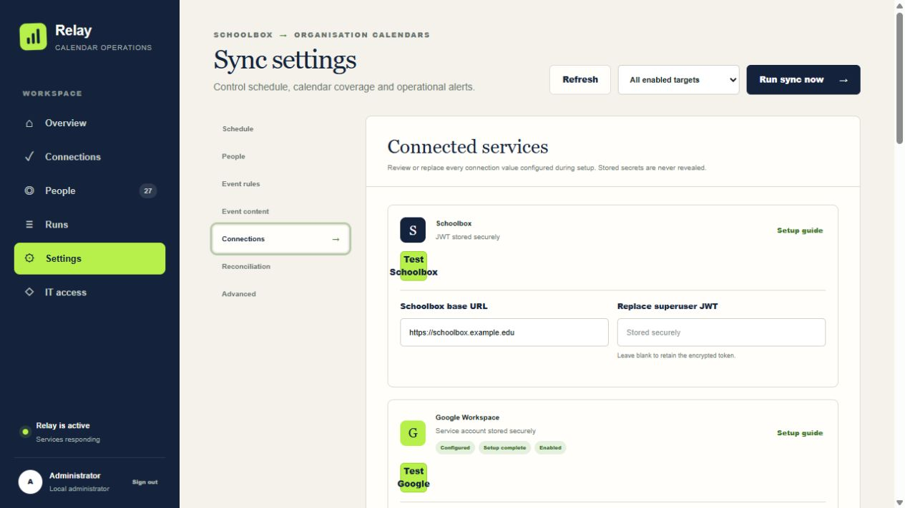](docs/screenshots/settings-connections.png) |
| **Reconciliation** | **Advanced operations** |
| [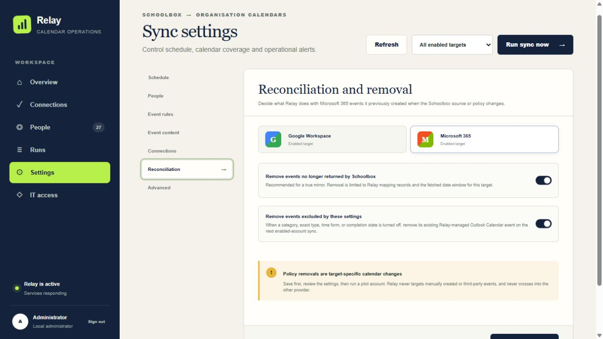](docs/screenshots/settings-reconciliation.png) | [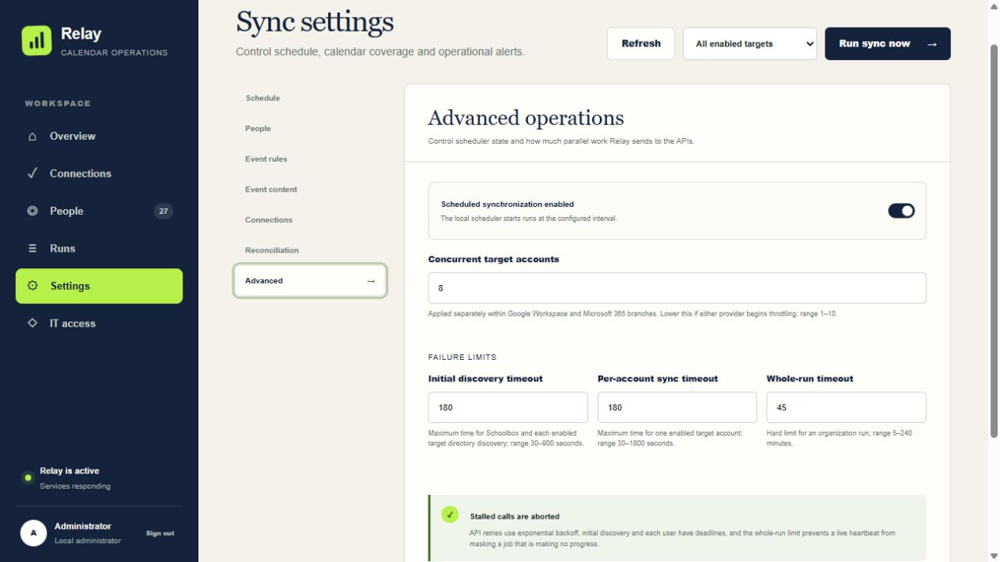](docs/screenshots/settings-advanced.png) |

## Architecture

- Next.js administration interface and API
- Integrated authenticated scheduler
- SQLite configuration and operational database
- Schoolbox calendar and user API client
- Google Admin SDK Directory client
- Google Calendar API client with Domain-Wide Delegation
- Microsoft Entra directory and Microsoft Graph Calendar client with app-only authentication
- Google OpenID Connect for approved IT staff
- AES-256-GCM encryption for stored credentials

Relay supports one application replica per SQLite database. The Node server listens on `0.0.0.0:3000`; production access requires an internal HTTPS reverse proxy and network restrictions to the IT subnet or VPN.

## Capabilities

- Independent Google Directory and Microsoft Entra user discovery with Schoolbox primary and alternate email matching
- Per-target, per-user enable and pause controls with bulk selection
- Per-Schoolbox-person category and exact event-type exclusions shared consistently across enabled targets
- Timetable, resource booking, school event, individual event, and custom event support
- Timed, all-day, and completed-item filters
- Global, category, and exact Schoolbox event-type rules
- Primary and Relay-created secondary Google Calendar and Outlook Calendar destinations
- Provider-native per-rule appearance: Google visibility/colour/reminders and Outlook availability/sensitivity/reminders
- Configurable event content and title prefixes
- Target-specific routing, managed-event reconciliation, per-user cleanup, and managed-calendar retirement
- Scheduled and manual all-target or single-target runs with phase/page diagnostics, per-user outcomes, event-action drill-down, progress timestamps, and run history
- Local break-glass administration and Google Workspace role-based access

## Requirements

- Linux server with Docker Engine and Docker Compose, or Node.js 22.13 or newer
- Internal DNS name and trusted TLS certificate
- Reverse proxy such as nginx, Caddy, IIS, or an existing internal load balancer
- Schoolbox 26.0 or newer
- Schoolbox superuser JWT with user-list and delegated calendar access
- At least one calendar target:
  - Google Workspace: a Google Cloud project with Admin SDK and Google Calendar API enabled, a service account with Domain-Wide Delegation, and a delegated administrator permitted to list Directory users
  - Microsoft 365: a single-tenant Microsoft Entra application with a client secret, tenant administrator consent, and Exchange Online mailboxes for synchronized users
- Google Web OAuth client with an Internal audience for IT sign-in; this controls Relay administrator access and is independent of the selected calendar targets

## Deployment

The complete first-time procedure is in the [Ubuntu installation guide](docs/installation.md). The shorter commands below are intended for administrators already familiar with Docker-based Linux deployments.

### Network

- Publish only the HTTPS reverse-proxy endpoint to the IT network or VPN.
- Restrict port `3000` to the reverse proxy or loopback.
- Set `APP_ORIGIN` to the exact externally accessed HTTPS origin.
- Use a hostname under an organisation-controlled domain. Google web OAuth and Microsoft admin-consent callbacks must resolve back to the configured `APP_ORIGIN`; production deployments require HTTPS.
- Use [deploy/nginx-relay.conf.example](deploy/nginx-relay.conf.example) as the nginx baseline.

### Docker

Generate the production environment:

```bash
npm run setup:env
```

This command creates `.env.production` with independent values for credential encryption, browser sessions, and scheduler authentication.

Build the image and create the local administrator:

```bash
docker compose build
docker compose run --rm relay node scripts/bootstrap-admin.mjs
```

The administrator bootstrap requires a username (`administrator` by default) and a password of at least 14 characters. It refuses to replace an existing owner.

Start the service:

```bash
docker compose up -d
docker compose ps
curl http://127.0.0.1:3000/api/health
```

The expected health response is `{"ok":true}`. Docker stores operational state in the `relay-calendar-data` volume.

### Native Node.js

```bash
npm ci
npm run setup:env
npm run auth:bootstrap
npm run build
npm start
```

The process supervisor must use the project directory as its working directory and restart the service on failure. Multiple application replicas must not share the SQLite database.

### Local development

```bash
npm ci
npm run setup:dev-env
npm run auth:bootstrap
npm run dev
```

The development origin is `http://127.0.0.1:3000`.

## Google configuration

### Domain-Wide Delegation

Create a dedicated Google service account and grant its numeric client ID the following scopes in **Google Admin > Security > Access and data control > API controls > Manage Domain Wide Delegation**:

```text
https://www.googleapis.com/auth/calendar.events.owned,https://www.googleapis.com/auth/calendar.app.created,https://www.googleapis.com/auth/admin.directory.user.readonly
```

The service-account JSON and delegated Workspace administrator email are configured from the independent **Connections > Google Workspace** guide. Completing or revisiting this guide does not alter the Microsoft 365 connection.

### IT OpenID Connect

The Google Web OAuth client used for administrator sign-in is separate from the synchronization service account.

1. Configure a Google OAuth consent screen with an **Internal** audience.
2. Create a **Web application** OAuth client.
3. Add the exact callback URL displayed under **IT access** as an authorised redirect URI.
4. Configure the Workspace domain, client ID, and client secret in Relay.
5. Add approved IT staff emails and assign a role.

Relay validates the signed ID token issuer, audience, expiry, nonce, verified email, Workspace domain, and stable Google subject. Workspace membership alone does not grant access.

## Microsoft 365 configuration

Microsoft 365 synchronization uses a confidential, single-tenant Entra application. Relay authenticates as the application with a tenant ID, application client ID, and client secret; it does not impersonate an interactive user.

### Entra application

1. In **Microsoft Entra admin center > App registrations**, create an application for **Accounts in this organizational directory only**.
2. For the redirect URI platform/application type, select **Web**. Do not select **Single-page application** or **Mobile and desktop applications / public client (native)**, and leave public client flows disabled. Add the exact Relay callback URI:

   ```text
   ${APP_ORIGIN}/api/auth/microsoft/admin-consent/callback
   ```

   For example, an `APP_ORIGIN` of `https://relay.example.edu` requires `https://relay.example.edu/api/auth/microsoft/admin-consent/callback`. The scheme, host, port, path, and trailing-slash form must match exactly.
3. Under **API permissions**, add these **Microsoft Graph application permissions**, not delegated permissions:

   ```text
   User.Read.All
   Calendars.ReadWrite
   ```

   `User.Read.All` permits Entra directory discovery. `Calendars.ReadWrite` permits primary-calendar event reconciliation and Relay-created secondary-calendar management in user mailboxes.
4. Create a client secret under **Certificates & secrets** and record its value immediately. Microsoft displays the secret value only when it is created.
5. In Relay, open **Connections > Microsoft 365**, enter the directory tenant ID, application client ID, client secret, and a pilot mailbox address, then complete the guided admin-consent and verification flow. The Microsoft target can be activated without configuring Google Workspace.

See the [Microsoft 365 setup and troubleshooting guide](docs/microsoft-365.md) for the portal checklist, permission verification, pilot rollout, identity refresh behavior, and common Graph errors.

### Admin consent and diagnostics

Use Relay's Microsoft 365 admin-consent action with a Microsoft **Privileged Role Administrator** or **Global Administrator** account. Relay sends the administrator to the tenant-specific Microsoft consent page and returns them to `/api/auth/microsoft/admin-consent/callback`. The callback validates the one-time state and returned tenant before accepting the result.

After consent, Relay requests the `https://graph.microsoft.com/.default` token scope through the client-credentials flow, which activates the application permissions configured on the registration. Relay then verifies Entra user discovery, access to the explicitly configured pilot mailbox's primary Outlook calendar, and secondary-calendar write access by creating and immediately deleting a clearly named temporary calendar. The connection status records a successful consent/diagnostic time. The diagnostic can be rerun from **Settings > Connections** and does not create calendar events. Relay requires a known licensed pilot mailbox and never selects an arbitrary directory user for a write probe.

The client secret is encrypted in the Relay database. Track its Entra expiry date and rotate it before expiration. Granting consent authorizes the Entra application at the tenant level; Relay's per-target user switches control which accounts the synchronization engine actually changes.

## Schoolbox configuration

Relay requires an HTTPS Schoolbox base URL and a superuser JWT. The JWT is created from the Schoolbox superuser record under `TOKENS`. Configure and validate it from **Connections > Schoolbox**.

## Independent connection setup

The **Connections** workspace contains separate setup guides for Schoolbox, Google Workspace, and Microsoft 365. Each guide stores its own completion and verification state. A provider guide saves and tests only that provider's connection fields; cancelled edits are discarded rather than leaking into another connection.

Relay becomes operational when the Schoolbox source and at least one enabled calendar target are complete. Google Workspace and Microsoft 365 can be added, reviewed, disabled, or reconfigured independently. Changing a target's identity or credential pauses only that target until its saved connection is verified again; the other completed target and the scheduler preference are preserved.

The first manual run discovers users in each enabled target directory and creates independent Schoolbox matches. Fresh installations leave newly discovered Google and Microsoft users paused by default, allowing coverage review before calendar writes. The two new-user defaults can be changed independently.

## Synchronization model

### Targets

Relay can operate in Google-only, Microsoft-only, or dual-target mode. In dual-target mode, a run performs one Schoolbox directory discovery and then reconciles each enabled delivery target independently. Directory identities, user enablement, event policy, calendar destinations, mappings, cleanup, and diagnostics remain provider-specific. Administrators can run all enabled targets or select Google Workspace or Microsoft 365 for an isolated manual run.

### Identity and coverage

- Target users are keyed by their stable Google or Microsoft Entra ID.
- For Microsoft 365, Relay prefers the uppercase `SMTP:` entry in `proxyAddresses` as the current primary address, then falls back to `mail` and `userPrincipalName`; aliases remain available for Schoolbox matching.
- A unique Schoolbox primary email match takes precedence over an alternate email match.
- Ambiguous addresses at the same match level remain unmatched.
- Inactive Schoolbox users are excluded from matching.
- Accounts present only in Google or Entra are labelled **Unmatched** as an informational state.
- Google and Microsoft coverage are controlled independently. Enabling or pausing an account for one target does not change the other target.
- Only matched users with **Calendar sync** enabled for the selected target are processed.
- Pausing a target user stops future changes on that target but retains its existing Relay-managed events.
- **Remove Relay events** pauses that target user and deletes only events recorded in Relay's mapping table for that provider.
- **Delete Relay calendars** first removes tracked events, then permanently deletes only that target user&apos;s tracked Relay-created secondary calendars. Primary calendars are never eligible.

### Safe pilot rollout

1. Configure only the intended target or targets, and leave both **Enable new Google users by default** and **Enable new Microsoft users by default** off.
2. For Microsoft 365, set a known licensed pilot mailbox as the diagnostic user and complete the admin-consent connection test.
3. Run discovery, then review the Google Workspace and Microsoft 365 user lists separately. Discovery does not enable newly found accounts while the corresponding default is off.
4. Enable one or a small number of matched users on only the intended target. A user may be enabled for Google, Microsoft, both, or neither.
5. Start a manual run for that target only and inspect the per-user and per-event results before expanding coverage.
6. To roll back a pilot account, remove its Relay-managed events for that target. Optionally delete its tracked Relay-created secondary calendars; unrelated events and primary calendars are not deleted.

The pilot switches constrain Relay's behavior, not the Entra application's tenant-wide Graph authorization or Google's delegated service-account authorization. Keep target coverage disabled until it has been reviewed.

### Event policy

Rule precedence is deterministic:

1. Global defaults for the selected target
2. Source category overrides
3. Exact Schoolbox event-type overrides

Google and Microsoft maintain separate policy and destination sets, so the same Schoolbox event type can be excluded, routed, or presented differently in each provider. Exact-type rules can override inclusion, destination, availability, privacy, and reminder behaviour; Google rules also support per-event colour. Timed, all-day, and completed-item switches remain target-level safeguards.

| Settings section | Function |
| --- | --- |
| Schedule | Run interval and rolling date window |
| People | Independent default coverage for newly discovered Google and Microsoft users |
| Event rules | Per-target category/type inclusion and calendar routing |
| Event content | Description, location, source link, annotations, and title prefix |
| Connections | Schoolbox, Google service account and delegation, Microsoft Entra client credentials and consent, directory settings, and time zone |
| Reconciliation | Removal of missing or newly excluded managed events |
| Advanced | Scheduler state, per-user concurrency, discovery/user/run deadlines |

Secondary calendars are created lazily in the selected provider when an included event targets the destination. Relay stores the returned provider calendar ID for each target user. Destination renames are applied during the next enabled-user sync; Google Calendar also receives the configured description and time zone, while Outlook retains those values as Relay routing metadata. Routing changes create the managed event in the new calendar before deleting the prior copy.

Removing routing leaves existing target calendars in place. **Retire and delete** operates only on the selected provider: it removes the destination from that provider's saved policy, deletes every tracked user copy, and removes its event mappings. Failed deletions remain visible for retry. Calendar deletion is permanent and also removes manually added content inside the deleted secondary calendar; Relay therefore limits this operation to recorded Relay-created calendar IDs and never targets a primary calendar.

Schoolbox API date ranges are divided into month-sized requests. Events with one missing timed boundary are normalized to a 30-minute duration; events with one missing all-day boundary are normalized to one calendar day.

Run diagnostics distinguish the 30-second process heartbeat from meaningful progress. Discovery records Schoolbox and provider-specific Google or Microsoft page checkpoints, user processing records aggregate completion, and finalization has its own phase. Configurable discovery, per-user, and whole-run deadlines abort stalled network work and ensure an unresolved dependency cannot leave a run permanently active.

Authenticated IT staff can open a run to review every enabled-user outcome by target. Failures include the affected identities, provider, processing stage, exact error, per-user counters, and any event being processed when the failure occurred. Event-action records include normalized Schoolbox content, source and provider identifiers, calendar routing, dates, action, and error context. The People screen exposes provider-specific managed events, Relay-created calendars, the latest user error, and recent run outcomes. High-volume historical drill-down data is retained for the newest 100 runs; run summaries remain available independently.

## Authentication and authorization

| Role | Permissions |
| --- | --- |
| Viewer | Dashboard, user mappings, and run history |
| Operator | Viewer permissions plus diagnostics and manual runs |
| Administrator | Operator permissions plus connection, policy, OAuth, and staff management |
| Local administrator | Administrator permissions plus local break-glass password ownership |

The local administrator uses a PBKDF2-HMAC-SHA-256 password hash. Google staff access is allowlist-based. Administrators can manage other Google staff accounts; only the local administrator can change the break-glass password. Microsoft Entra admin consent authorizes the synchronization application only and does not grant access to the Relay administration interface.

Sessions use opaque random tokens stored as hashes, HTTP-only cookies, an eight-hour absolute lifetime, a 30-minute idle timeout, CSRF tokens, and exact-origin validation. The interface warns five minutes before expiration. Five failed local password attempts lock the account for 15 minutes.

## Persistence and security

SQLite stores encrypted connection credentials, configuration, staff access, session hashes, user mappings, managed-event mappings, calendar destinations, audit entries, and run history.

`CONFIG_ENCRYPTION_KEY` protects Schoolbox, Google service-account and OAuth credentials, and the Microsoft client secret with AES-256-GCM. The database and its matching environment file form one recovery set. Sensitive files, backups, and credentials require restricted filesystem permissions and protected backup storage.

Relay makes outbound HTTPS requests only to the configured Schoolbox host and the enabled providers' identity, directory, OAuth, and calendar endpoints.

## Operations

- Health: `GET /api/health`
- Container status: `docker compose ps`
- Logs: `docker compose logs -f --tail=200 relay`
- Stop: `docker compose down`
- Scheduler and run diagnostics: **Runs**
- Connection diagnostics: **Settings > Connections**
- Backup, restore, upgrade, and password recovery: [Operations guide](docs/operations.md)

## References

- [Schoolbox API](https://api.schoolbox.com.au/)
- [Google Workspace Domain-Wide Delegation](https://developers.google.com/identity/protocols/oauth2/service-account#delegatingauthority)
- [Google Calendar authorization scopes](https://developers.google.com/workspace/calendar/api/auth)
- [Google Calendar event resource](https://developers.google.com/workspace/calendar/api/v3/reference/events)
- [Google Directory users.list](https://developers.google.com/workspace/admin/directory/reference/rest/v1/users/list)
- [Google OpenID Connect](https://developers.google.com/identity/openid-connect/openid-connect)
- [Google OAuth web server applications](https://developers.google.com/identity/protocols/oauth2/web-server)
- [Microsoft identity platform client-credentials flow](https://learn.microsoft.com/en-us/entra/identity-platform/v2-oauth2-client-creds-grant-flow)
- [Microsoft Graph permissions overview](https://learn.microsoft.com/en-us/graph/permissions-overview)
- [Microsoft Graph permissions reference](https://learn.microsoft.com/en-us/graph/permissions-reference)
- [Microsoft Graph list users](https://learn.microsoft.com/en-us/graph/api/user-list?view=graph-rest-1.0)
- [Microsoft Graph create calendar](https://learn.microsoft.com/en-us/graph/api/user-post-calendars?view=graph-rest-1.0)
- [Microsoft Graph create event](https://learn.microsoft.com/en-us/graph/api/calendar-post-events?view=graph-rest-1.0)
- [Microsoft Graph throttling guidance](https://learn.microsoft.com/en-us/graph/throttling)
- [Next.js self-hosting](https://nextjs.org/docs/app/guides/self-hosting)

## License

Relay is licensed under the [MIT License](LICENSE).
